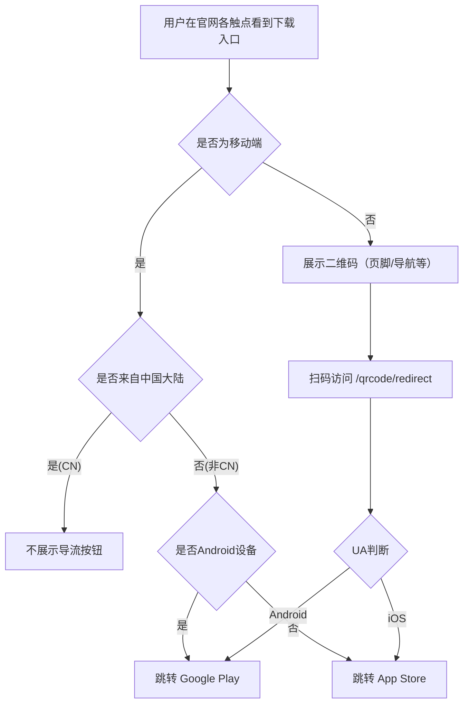

# gdesign/meta MR 11531 技术方案：H5 导流 APP 下载二期（#GJY-20434）

## MR 元信息

- 标题：feat: 【业务需求】H5导流APP下载二期 #GJY-20434
- MR 链接：`https://git.intra.gaoding.com/gdesign/meta/-/merge_requests/11531`
- 工单：[#GJY-20434](https://pingcode.intra.gaoding.com/pjm/workitems/GJY-20434)
- 来源分支：feature/kaola/s15_h5guide2app → 目标分支：master
- 作者：kaola
- 创建时间：2025-08-06T08:21:58.421Z；最近更新时间：2025-08-13T03:28:14.385Z

## 背景与目标

本期为 H5 导流 APP 下载二期改造，目标是在官网不同位置（首页首屏、导航、菜单、页脚、工具页、工作台侧边栏等）提供一致的导流组件与二维码能力，依据设备与地域自动选择跳转目标（Google Play 或 App Store），并完善曝光/点击埋点与可回流的二维码跳转页。

## 变更总览

- 变更文件总数：37
- 新增文件：12
- 删除文件：3
- 修改文件：22

变更要点：

- 新增通用导流组件 `www-insmind/routes/(vue3)/components/guide-app-button/`（Android/App Store 按钮 + 常量 + 包装索引）。
- 新增顶部提示条组件 `www-insmind/routes/(vue3)/components/app-tip/index.vue`，支持本地存储关闭与限时再展示（当前 20 分钟，生产建议 24 小时）。
- 引入二维码能力（依赖 `qrcode`），并新增 SSR/CSR 友好的 `/qrcode/redirect` 路由，用于扫码后按 UA 重定向应用商店。
- 在首页落地组件、导航菜单、页脚、工具页、工作台左侧菜单等多个位置集成导流与二维码展示；埋点统一接入 `windAPI`。
- 在多处以 `context().request.headers.get('cf-ipcountry')` 判断地域（非 CN 才展示导流按钮），以 `isAndroid()` 判断设备端。
- 若干脚本初始化与语法细节优化（SLS、gtag 初始化语句括号简化）。

## 详细设计

### 1. 通用导流组件

- 新增目录：`www-insmind/routes/(vue3)/components/guide-app-button/`
  - `constant.ts`：统一维护 Google Play/App Store 链接与图标。
  - `android-button.vue`、`appstore-button.vue`：分别渲染下载按钮，支持可选动画高亮，内置曝光与点击埋点（`windAPI.trackButtonExpose/trackButtonClick`）。
  - `index.vue`：运行时判定平台，懒加载对应按钮组件；使用 `ClientOnly` 包裹，避免 SSR 报错。

埋点说明：

- tracker 字段统一包含：`module_name`、`source`、`page_name`、`button_name`、`subject_name`。不同挂载点仅 `source/button_name` 不同，便于归因。

### 2. 顶部提示条（移动端）

- 新增：`www-insmind/routes/(vue3)/components/app-tip/index.vue`
  - CSR 初始化后检查移动端且未在冷却期内，显示顶部下载提示条。
  - 本地存储键：`guide_app_storage`；当前冷却时间为 20 分钟（上线前建议改为 24 小时）。
  - 点击跳转与曝光均接入埋点。

### 3. 导航与菜单改造

- `async-base-header`：
  - `components/common-components/base-nav.vue`：
    - 新增 App 下载引导区（可显示二维码，内部按钮复用通用导流组件）。
    - 使用 `QRCode.toDataURL()` 生成二维码，链接指向 `/qrcode/redirect`（由 UA 决定商店跳转）。
  - `components/common-components/resource.vue`：开启 `showAppButton` 显示导流区域。
  - `components/menu/index.vue`：在导航抽屉底部增加导流按钮（非 CN 区域展示）。
  - `components/user/index.vue`：顶部登录态区域在移动端根据滚动/地域条件显示“Try Free in App”；封装 `nav-app-button.vue` 并接入埋点。

### 4. 页脚与落地页改造

- 页脚重构为 Widget 版本：
  - 新增：`www-insmind/routes/(vue3)/components/async-base-footer/index@widget.vue` 与 `config.ts`（媒体链接配置），并在 `index.tsx` 中改为渲染 Widget 组件。
  - 页脚右侧新增“Get App”区域与二维码。
- 落地页底部组件替换：
  - 原 `landing-page-footer` TSX 版本删除，新增 Widget 版本 `index@widget.vue` 并在各路由处替换为 Widget 渲染（`[[landing]]@route.tsx`、`tools/[[tool]]@route.tsx`）。

### 5. 首页首屏与工具页改造

- 首页首屏 Banner：`(landing)/components/flow-banner/`
  - `download-app.vue` 改为直接复用通用导流组件。
  - `index.vue` 使用 `context().request.headers.get('cf-ipcountry') !== 'CN'` 判定是否显示按钮（且需为移动端）。
- 工具页移动端下载区：
  - `components/tool/components/download/mobile.vue` 在非 CN 区域、未禁用时显示 “Edit more” 下载按钮并上报埋点。

### 6. 工作台侧边栏导流

- `components/workspace-layout/aside-left@widget.vue`：
  - 左侧菜单底部新增“Get App”Tooltip，内含 App Store/Google Play 按钮与二维码。
  - 样式与布局适配；同时调整 `.left` 容器 z-index 与高度，预留顶部 Banner 高度。

### 7. 二维码与跳转路由

- 新增路由：`/qrcode/redirect/`
  - 文件：`(vue3)/qrcode/redirect/index@route.tsx` 与 `index@widget.vue`
  - CSR 阶段根据 `isAndroid()` 重定向至 Google Play 或 App Store。
  - 各处二维码统一生成该链接，便于一处维护 UA 逻辑与跳转策略。
- 依赖新增：在 `www-insmind/routes/(vue3)/package.json` 增加 `qrcode@^1.5.4`。

### 8. 地域与平台判定

- 地域：SSR 通过 `context().request.headers.get('cf-ipcountry')`；仅非 `CN` 展示导流按钮（大陆地区不展示）。
- 平台：CSR 通过 `isAndroid()`（`www-insmind/utils/ua.ts` 新增导出）决定默认商店与文案。

### 9. 埋点与数据

- 曝光：`windAPI.trackButtonExpose(...)`
- 点击：`windAPI.trackButtonClick(detail, callback)`；回调里执行 `location.href = link` 确保点击上报后跳转。
- 各挂载点 `module_name/source/button_name` 差异化，便于分渠道统计：
  - 首页首屏：module_name=H5导流APP下载，source=官网首页首屏
  - 顶部提示条：source=官网顶部下载APP-Banner
  - 导航菜单：source=官网导航菜单弹窗
  - 导航 Resources 弹层：module_name=WEB导流APP下载，source=官网导航-Resources菜单弹窗
  - 页脚：source=官网页脚
  - 落地页底部 Banner：source=官网底部下载APP-Banner
  - 工具页下载区：source=工具组件-编辑更多
  - 顶部导航登录区按钮：source=官网顶部导航栏

### 10. 其他细节

- SLS/gtag 初始化脚本语法风格统一（去掉多余括号），无功能影响。
- 若干样式细节（按钮 visited 颜色、tooltip 样式、布局间距等）。

## 风险评估与兼容性

- SSR/CSR：
  - 二维码生成与 UA 判断均在 CSR 阶段执行，相关组件使用 `ClientOnly` 或 `onMounted` 保证运行时环境正确。
  - 依赖 Cloudflare `cf-ipcountry` 请求头，如网关未透传需兜底逻辑（例如默认不展示导流）。
- 地域策略：只屏蔽 CN，其他地区默认展示；如有合规要求需扩展名单。
- 存储时长：顶部提示条当前 20 分钟为走查配置，上线前需改为 24 小时。
- 性能：二维码为 80/100px 的 dataURL，onMounted 生成，影响极小；避免在首屏阻塞。
- 可访问性：下载按钮为 `a`，已处理 `:visited` 颜色，确保对比度与可点击区域。
- i18n：文案均通过 `$tsl`，需确认多语言资源完整。

## 发布与灰度建议

- 建议增加环境变量或远端配置开关，用于快速关闭导流区域（导航/页脚/提示条等）。
- 先在少量流量（如 5%）验证埋点、跳转与二维码有效率，再逐步放量。

## 测试用例建议

- 展示逻辑：
  - 移动端 vs 桌面端（`isMobile()`）
  - 地域 CN vs 非 CN（模拟/注入 `cf-ipcountry`）
  - Android vs iOS（UA 覆盖）
- 跳转逻辑：
  - `/qrcode/redirect` 在 Android → Google Play，iOS → App Store
  - 导航、页脚、首页首屏、工具页、工作台侧边栏各触点点击均正确跳转
- 埋点校验：
  - 各触点曝光/点击上报字段完整，`module_name/source/button_name/subject_name/page_name` 正确
- 提示条冷却：
  - 关闭后在 20 分钟内不再出现，时间到重新出现（上线前改 24h 并回归）
- 视觉与交互：
  - 按钮动画、hover、visited 状态
  - Tooltip 与二维码呈现位置、清晰度

## 回滚策略

- 代码回滚至 MR 前版本；或通过开关关闭所有导流入口。
- 保留 `/qrcode/redirect` 路由不影响其他功能，可无需紧急回滚。

## 监控与验收

- 关键指标：点击率（CTR）、扫码转化、商店到达率、各触点曝光次数。
- 埋点日志监控异常率；SLS RUM 正常采集。

## 变更文件清单（节选）

- 新增
  - `www-insmind/routes/(vue3)/components/app-tip/index.vue`
  - `www-insmind/routes/(vue3)/components/guide-app-button/android-button.vue`
  - `www-insmind/routes/(vue3)/components/guide-app-button/appstore-button.vue`
  - `www-insmind/routes/(vue3)/components/guide-app-button/constant.ts`
  - `www-insmind/routes/(vue3)/components/guide-app-button/index.vue`
  - `www-insmind/routes/(vue3)/components/async-base-footer/index@widget.vue`
  - `www-insmind/routes/(vue3)/components/async-base-footer/config.ts`
  - `www-insmind/routes/(vue3)/components/landing-page-footer/index@widget.vue`
  - `www-insmind/routes/(vue3)/qrcode/redirect/index@route.tsx`
  - `www-insmind/routes/(vue3)/qrcode/redirect/index@widget.vue`
- 删除
  - `www-insmind/routes/(vue3)/components/async-base-footer/index.less`
  - `www-insmind/routes/(vue3)/components/landing-page-footer/index.less`
  - `www-insmind/routes/(vue3)/components/landing-page-footer/index.tsx`
- 修改（部分）
  - `www-insmind/routes/(vue3)/(landing)/components/flow-banner/download-app.vue`
  - `www-insmind/routes/(vue3)/(landing)/components/flow-banner/index.vue`
  - `www-insmind/routes/(vue3)/(landing)/components/main/index@widget.vue`
  - `www-insmind/routes/(vue3)/(landing)/components/suggest/index.vue`
  - `www-insmind/routes/(vue3)/(landing)/[[landing]]@route.tsx`
  - `www-insmind/routes/(vue3)/components/async-base-footer/index.tsx`
  - `www-insmind/routes/(vue3)/components/async-base-header/components/common-components/base-nav.vue`
  - `www-insmind/routes/(vue3)/components/async-base-header/components/common-components/resource.vue`
  - `www-insmind/routes/(vue3)/components/async-base-header/components/menu/index.vue`
  - `www-insmind/routes/(vue3)/components/async-base-header/components/user/index.vue`
  - `www-insmind/routes/(vue3)/components/async-base-header/components/user/nav-app-button.vue`
  - `www-insmind/routes/(vue3)/components/async-base-header/components/logout.vue`
  - `www-insmind/routes/(vue3)/components/tool/components/download/mobile.vue`
  - `www-insmind/routes/(vue3)/components/workspace-layout/aside-left@widget.vue`
  - `www-insmind/routes/(vue3)/components/workspace-layout/index.module.less`
  - `www-insmind/routes/(vue3)/package.json`（新增依赖 qrcode）
  - `www-insmind/routes/_root@layout.ts`、`apps/example-app/routes/_root@layout.ts`、`www/routes/_root.ts`（初始化脚本语法优化）
  - `www-insmind/utils/ua.ts`（新增 `isAndroid`）

## Mermaid 流程示意

## MR 标题建议

H5 导流 APP 下载二期：新增通用导流组件、二维码下载链路与多触点集成（导航/页脚/首页/工具页/工作台）
